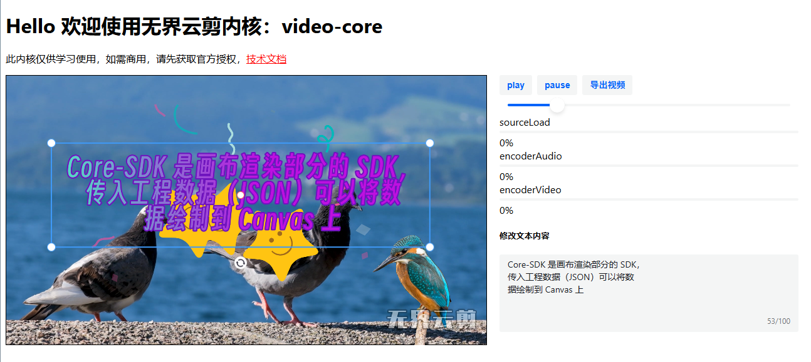

# wujie-mp4-encoder-core

无界云剪MP4渲染内核，基于webcodes + ffmpeg + webgl开发，纯前端MP4视频的编解码，MP3混音。

此内核仅供学习使用，如需商用，请先获取官方授权：[无界云剪官网](https://video.h5ds.com)

[Core-SDK技术文档](https://video.h5ds.com/docs/sdk/core.html)

# 启动项目

1. 安装依赖

   > npm install

2. 启动项目
   > npm dev
